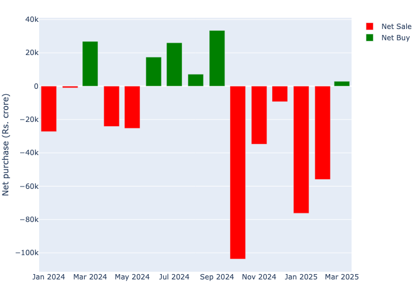

# FPIs in India: 2024-2025

2025 saw major selling by the FPIs (Foreign Portfolio Investors)[^1] in
the Indian equity markets. They (net) sold about 1.2 lac crores.[^2]
2024 was no different - there were more months of net selling than net
buying. See <a href="#fig-mnthly-net" class="quarto-xref">Figure 1</a>
below. Despite the aggressive selling the markets ended the year
marginally higher as domestic buying stepped in.

Figure 1: Net Purchases 2024-2025

FPIs add considerable liquidity and depth to the Indian capital markets.
In 2024, FPIs accounted for about 17% of the total turnover on NSE,
buying and selling about 18,000 crore shares.[^3]

As of September 2025, there were about 12086 FPIs registered in India,
30% of whom were from the US.
<a href="#tbl-country-dist" class="quarto-xref">Table 1</a> lists the
top 5 FPI origin countries.

Table 1: FPIs country of origin

      country_name  proportion
    0           US       29.76
    1   LUXEMBOURG       12.01
    2      IRELAND        7.14
    3       CANADA        6.71
    4    SINGAPORE        5.53

### NSDL data

NSDL has a rich dataset on the daily FPI transactions, which goes back
to 2003. But unfortunately this data is released with an enormous
delay.[^4] The latest is from March 2025.

There are some gaps in the data. For instance, the FPI IDs are masked,
for pivacy reasons, and these IDs change every month so longitudinal
views cannot be constructed. This also makes it impossible to link the
FPIs to their country of origin (using FPI registration data) to see
in-/out-flows by country. However, this is still an interesting dataset
to explore.

### FPI transactions

Based on the NSDL data, the top 5-10 stocks (net) sold/bought in
2024-2025 (see <a href="#tbl-top5" class="quarto-xref">Table 2</a>). The
top 5 net sold are large cap stocks and are part of the Nifty 50.
Interetingly, the net bought top 5 are not all large cap ones. There are
a couple of stocks that are mid-cap. So, there appears to be some
shuffling away from large cap to mid caps in this past year.

Table 2: Top 5 net sold 2024-2025

                 Company Net\n Purchase (Rs cr.)
    Reliance Industries                 -49562.2
              Axis Bank                 -31163.5
        Larsen & Toubro                 -20834.5
    Maruti Suzuki India                 -17027.9
    Kotak Mahindra Bank                 -14240.5

                        Company Net\n Purchase (Rs cr.)
                    ICICI Bank                  13660.6
                 Bharti Airtel                  12353.2
                     HDFC Bank                  10274.7
                  Indus Towers                   8773.4
    Five-Star Business Finance                   4928.4

I extracted, cleaned, and built an app in Python Shiny around the
2024-2025 data for exploration. Students and others interested in this
data can use this [app.]()

[^1]: FPIs are large foreign institutional investors such as sovereign
    funds and large qualified foreign investors who invest in the Indian
    capital markets.

[^2]: https://www.fpi.nsdl.co.in/Reports/Yearwise.aspx?RptType=5

[^3]: These are my calculations using NSE total turnover data and the
    total shares from the NSDL data above

[^4]: https://www.fpi.nsdl.co.in/web/StaticReports/FIITradeWise2008/FIITradeWise2008.htm

