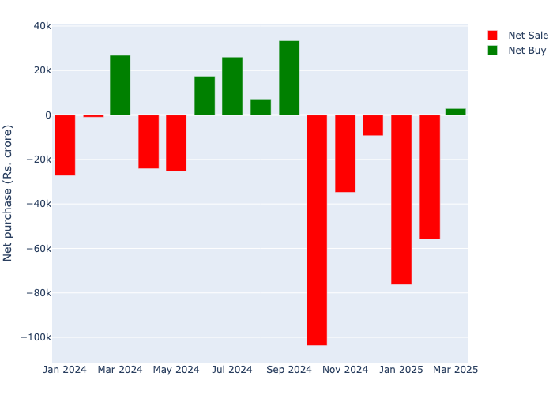

2025 saw major selling by the FPIs (Foreign Portfolio Investors)[^1] in the
Indian equity markets. They (net) sold about 1.2 lac crores.[^2] 2024 was no
different - there were more months of net selling than net buying. See
@fig-mnthly-net below. Despite the aggressive selling the markets ended the 2025
(Jan-Dec)
marginally higher as domestic buying stepped in.

[^1]: FPIs are large foreign institutional investors such as sovereign funds and large qualified foreign investors who invest in the Indian capital markets.

[^2]: https://www.fpi.nsdl.co.in/Reports/Yearwise.aspx?RptType=5

```{python}
from pathlib import Path
import plotly.express as px
import pyarrow.parquet as pq
import pandas as pd
import numpy as np
```

```{python}

COL_NAMES = ["Company", "Net\n Purchase (Rs cr.)"]

pth = Path("fpi_data/")
datfile = "fpi_id_2024_2025_mgd_jan2026.parquet"

df = pq.read_table(Path(pth / datfile))
df = df.to_pandas()
```

```{python}

# --- Transaction type - buy or sell only
df = df[(df["TR_TYPE"] == 1) | (df["TR_TYPE"] == 4)]  #
df["TR_TYPE"] = df["TR_TYPE"].astype("category")
df["TR_TYPE"] = df.TR_TYPE.cat.rename_categories({1: "Buy", 4: "Sell"})
df["month"] = df.month.str.strip()
df["year"] = df.year.astype(int)
df["TR_DATE"] = pd.to_datetime(df["TR_DATE"])

# ---- Keep Equity Only
df = df[(df["instrument_type"] == "Equity")]
```

```{python}
# | label: fig-mnthly-net
# | fig-cap: FPI net purchases 2024-2025


def mnthly_net() -> pd.DataFrame:
    """Returns dataframe with net positions at monthly level"""
    df_wide = (
        df.pivot_table(
            index=["TR_DATE", "month", "year"],
            columns="TR_TYPE",
            values="VALUE",
            aggfunc="sum",
            observed=True,
        )
        .rename(columns={1: "Buy", 4: "Sell"})
        .reset_index()
    )
    cols_to_fill = ["Buy", "Sell"]
    df_wide[cols_to_fill] = df_wide[cols_to_fill].fillna(0)
    df_wide["net_crores"] = np.round((df_wide["Buy"] - df_wide["Sell"]) / 10000000, 2)
    df_wide["Color_Group"] = df_wide["net_crores"].apply(
        lambda x: "Net Buy" if x >= 0 else "Net Sale"
    )
    return df_wide


def monthly_agg_chart():
    dt = mnthly_net()
    f_df = (
        dt.groupby(["month", "year"])
        .sum(["net_crores"])
        .sort_values(by="net_crores", ascending=True)
        .reset_index()
    )
    f_df["m_y"] = pd.to_datetime(
        f_df["month"] + f_df["year"].astype(str), format="%b%Y"
    ).astype(str)
    f_df["Color_Group"] = f_df["net_crores"].apply(
        lambda x: "Net Buy" if x >= 0 else "Net Sale"
    )

    lineplot = px.bar(
        data_frame=f_df,
        x="m_y",
        y="net_crores",
        color="Color_Group",  # "TR_TYPE",
        color_discrete_map={"Net Buy": "green", "Net Sale": "red"},
        # color="TR_TYPE",
        # barmode="group",
        title="",
        labels={
            "TR_TYPE": "",
            "m_y": "",
            "net_crores": "Net purchase (Rs. crore)",
            "Color_Group": "",
        },
    )
    return lineplot


plt = monthly_agg_chart()
plt.write_image("www/monthly_figure.png")
```

{#fig-mnthly-net}

### FPIs in India


```{python}

fpi_reg = pd.read_csv("fpi_data/fpi_clean_all.csv", index_col=0)
number_of = fpi_reg.shape[0]
```

As of September 2025, there were about `{python} number_of` FPIs registered in
India, 30% of whom were from the US. @tbl-country-dist lists the top 5 FPI
origin countries.

```{python}
# | label: tbl-country-dist
# | tbl-cap: FPIs country of origin
df_by_country = fpi_reg.country_name.value_counts(normalize=True).reset_index()
df_by_country["proportion"] = np.round(df_by_country["proportion"] * 100, 2)
print(df_by_country.head())
del df_by_country, fpi_reg
```

FPIs add considerable liquidity and depth to the Indian capital markets. In
2024, FPIs accounted for about 17% of the total turnover on NSE, buying and
selling about 18,000 crore shares.[^3]

[^3]: These are my calculations using NSE total turnover data and the total shares from the NSDL data above

### NSDL's FPI data

NSDL has a rich dataset on the daily FPI transactions, which goes back to 2003. But unfortunately this data is released with an enormous delay.[^4] The latest is from March 2025.

[^4]: https://www.fpi.nsdl.co.in/web/StaticReports/FIITradeWise2008/FIITradeWise2008.htm

There are some challenges in the data. For instance, the FPI IDs are masked for pivacy reasons it impossible to link the FPIs to their country of origin (using FPI registration data) if you'd like to calculate in-/out-flows by country at the stock-level, etc. Furthermore, these IDs change every month so creating longitudinal views is out of the question. That said this is still an interesting dataset to explore.


### FPI transactions
Based on the NSDL data, the top 5-10 stocks (net) sold/bought in 2024-2025 (see @tbl-top5). The top 5 net sold are large cap stocks and are part of the Nifty 50. Interetingly, the net bought top 5 are not all large cap ones. There are a couple of stocks that are mid-cap. So, there appears to be some shuffling away from large cap to mid caps in this past year.

```{python}

dft = df[((df["TR_DATE"] >= "2024-04-01") & (df["TR_DATE"] <= "2025-03-31"))]

CRORE = 10000000


def net_stock(dft):
    """Returns dataframe with net positions at {stock-month} level"""
    df_wide = (
        dft.pivot_table(  # type: ignore
            index=["TR_DATE", "month", "year", "company_name"],
            columns="TR_TYPE",
            values="VALUE",
            aggfunc="sum",
            observed=True,
        )
        .rename(columns={1: "Buy", 4: "Sell"})
        .reset_index()
    )
    cols_to_fill = ["Buy", "Sell"]
    df_wide[cols_to_fill] = df_wide[cols_to_fill].fillna(0)
    df_wide["net_crores"] = (df_wide["Buy"] - df_wide["Sell"]) / 10000000
    df_wide["net_crores"] = df_wide["net_crores"].round(2)
    f_df = (
        df_wide.groupby(["company_name"])
        .sum("net_crores")
        .sort_values(by="net_crores", ascending=True)
        .reset_index()
    )
    return f_df

```
```{python}
#| label: tbl-top5
#| tbl-cap: Top 5 net sold 2024-2025
def top_sold(numbr):
    f_df = net_stock(dft=dft)
    d1 = f_df.sort_values("net_crores")[["company_name", "net_crores"]].iloc[:numbr]
    d1["net_crores"] = d1["net_crores"].round(1).astype(str)
    d1.columns = COL_NAMES

    return d1
tb = top_sold(5)
tb['Company'] = tb['Company'].str.replace("Limited","")
print(tb.to_string(index=False))
```
```{python}
#| tbl-cap: Top 5 net bought in 2024-2025
def top_bought(numbr):
    f_df = net_stock(dft=dft)
    d1 = f_df.sort_values("net_crores", ascending=False)[
        ["company_name", "net_crores"]
    ].iloc[:numbr]
    d1["net_crores"] = d1["net_crores"].round(1).astype(str)
    d1.columns = COL_NAMES
    return d1
tb = top_bought(5)
tb['Company'] = tb['Company'].str.replace("Limited","")
print(tb.to_string(index=False))
```

I extracted, cleaned, and built an app in Python Shiny around the 2024-2025 data for exploration. Students and others interested in this data can use this [app.](fpi-dahi-dimag-linux-599110706922.europe-west1.run.app) 

The app allows you to explore the data at the stock level, and also see the top 5 net bought/sold stocks by month. You can also see the net positions by month for a stock of your choice. The app is built using Python Shiny and Plotly for interactive visualizations.


### concentration and volatility!


-   FPI sell most on Thursdays.
-   When they sell the volume in the markets rises. The often sell small quantities in a day, cannot fix the time, but likely early in the day to check if there is liquidity to absord their selling,

What are the top 5 invested in the first three months.

What are the average weighted prices..

Did these top 5 fall or no? in that time period.

Did this increase the volume, etc..

talk about concentration in these stocks.. etc. weave in that..


TODO

* A report for sale: summarizing the FPI data (as a plug in for other report!)
* when did FPI start accumulating this stock?
* what is the % holding of FPIs in the stock?
* FPI value holding until (accumulated over) the years. 
